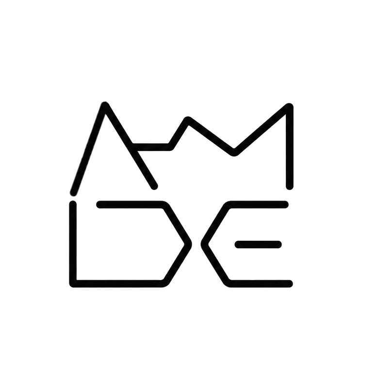

<p align="center">
  <picture>
    <source media="(prefers-color-scheme: dark)" srcset="assets/brand/amide_logo_v4.1_white_transparent_bg.png">
    <source media="(prefers-color-scheme: light)" srcset="assets/brand/amide_logo_v4.1_black_transparent_bg.png">
    
  </picture>
</p>

<h1 align="center">AMIDE</h1>

<h3 align="center">
Adaptive Machine Intelligence Development Engine
</h3>

<p align="center">
  <a href="docs/AMIDE-ROADMAP.md">Roadmap</a> &bull;
  <a href="docs/AMIDE Implementation Specification.md">Implementation Spec</a> &bull;
  <a href="UPSTREAMS.md">Upstreams</a> &bull;
  <a href="packages/coding-agent/docs/index.md">CLI Documentation</a>
</p>

AMIDE runs on a persistent iPython/RLM session — self-extensible via live
TypeScript extensions (`/reload`, no rebuild required), daemon-backed
resident workers, recursive subagents, goals, schedules, and autonomous mode
that survive terminal detach — composed through a Cordis Metaframework
runtime and disciplined by a Monotonic Prompt Architecture (MPA): every
request to a model stays append-only within a cache epoch, so long sessions
keep a high prompt-cache hit rate and token spend that stays roughly flat
instead of climbing as they grow. Token efficiency is a stated
differentiator here, not a side effect. See
[Acknowledgements](#acknowledgements) below for what this is built on.

**Forward direction:** AMIDE is intended to become multi-surface — one
central agent that extends itself with new capabilities and can drive
multiple presentation surfaces (an Electron GUI, a web-app server) rather
than owning a single fixed UI, in the spirit of Cordis's and Pi's own
extensibility philosophy. See `docs/AMIDE-ROADMAP.md` for what's actually
built versus what's stated direction.

> [!NOTE]
> AMIDE is an active fork of Prime Agent. Internal source, some environment
> variables, and install scripts still say "Prime Agent" in places where
> renaming would mean rebranding a vendored third-party library (`pi-tui`,
> `pi-ai`, `pi-agent-core`) rather than AMIDE's own code — see
> `docs/AMIDE-ROADMAP.md` and `UPSTREAMS.md` for exactly what's ours versus
> upstream.

Prime Agent — the execution model AMIDE builds on — is designed around two
core abstractions:

- The **[Recursive Language Model (RLM)](https://www.primeintellect.ai/blog/rlm)** treats context as variables (*prompt-as-a-variable*) and tools like recursive subagents as function calls (*programmatic tool/sub-agent calling*) inside a persistent REPL.
- The **[Continual Harness](https://arxiv.org/abs/2605.09998)** stores supplemental prompts, memories, skill descriptions, and reusable subagent specifications as durable state that can be refined through small, evidence-backed updates, local to the session by default.

- **Everything is programmatic:** a persistent Python REPL is the built-in model tool; file operations, shell commands, tool use, subagents, and context management happen through code.
- **Subagents are built in:** `rlm(...)` spawns real child agents for parallel or background work and returns their results programmatically.
- **The harness can improve:** `/refine` reviews the current trajectory and can apply small, evidence-backed updates to supplemental harness state. It never rewrites the immutable base system prompt, and recorded snapshots support rollback.
- **Skills are executable:** skills are importable Python packages, and the built-in skill creator can turn recurring workflows into project or personal skills.
- **Sessions run in the background:** daemon-backed agents keep running when the terminal disconnects and can be reattached later.
- **Agents communicate directly:** running agents can exchange messages and orchestrate one another without routing everything through the user.
- **Long tasks keep moving:** automatic compaction, persistent goals, heartbeats, schedules, autonomous mode, and retained subagents preserve progress across turns and terminal sessions.

## Getting Started

AMIDE isn't published yet; run it from source (Node.js 22.8.0+):

```bash
git clone git@github.com:amidedev/amide.git
cd amide
npm ci
```

Start it from the repository or directory you want it to work in — the
script preserves the caller's working directory, so it can be run against a
separate test project from anywhere:

```bash
/path/to/amide/amide.sh
```

On first launch, run `/login` to choose a subscription or API-key provider.
AMIDE works in the current directory and can run commands and modify files
there. Use a disposable clone, clean worktree, or another checkpoint you can
inspect and restore.

> [!WARNING]
> AMIDE executes model-generated Python and project commands with your user
> permissions. Its worker and kernel processes improve lifecycle isolation
> and recovery; they are **not** a security sandbox. Review changes and use
> trusted repositories, instructions, skills, and extensions only. Run
> untrusted code or instructions in an external sandbox or restricted
> environment.

Useful commands:

```bash
amide agents                   # Browse running, idle, and saved sessions
amide attach <agent>           # Reattach to a running session
amide --resume [path|id]       # Browse sessions or resume one directly
amide status                   # Inspect background service state
amide doctor [--fix]           # Inspect or repair background services
amide update [--force]         # Update AMIDE
amide shutdown [--force]       # Stop every agent, worker, and background service
```

## Built for Long-Running Work

AMIDE is built for long-running work, especially for evaluations in
research. These features are available in the TUI, and when run
autonomously.

- **Continual Harness:** `/refine` can persist focused, reviewable lessons as supplemental prompts, memories, reusable skill descriptions, or subagent specifications, with recorded refinement history. It does not replace packaging and reviewing new executable skills.
- **Direct agent-to-agent communication:** running agents and retained subagents can discover one another, exchange messages, and steer active work.
- **Daemon-backed continuity:** active sessions, Python REPL state, schedules, and subagents keep running when the terminal detaches and can be reattached later.
- **Heartbeats and schedules:** `/heartbeat`, `rlm_heartbeat`, and `amide schedule` can re-enter a session periodically or at a specific time.
- **Persistent goals:** `/goal` keeps an objective and its progress active across turns until it is completed, paused, or cleared.
- **Bounded autonomous mode:** `/autonomous` continues within configured turn, token, and time budgets and can run user-defined quality gates. A passed gate checks only what that gate verifies; reaching a limit does not imply task success.

## Documentation

- [Quickstart](packages/coding-agent/docs/quickstart.md) — install, authenticate, and run a first session
- [Usage and CLI reference](packages/coding-agent/docs/usage.md) — commands, sessions, autonomous limits, and output modes
- [Long-running and background agents](packages/coding-agent/docs/long-running-agents.md) — detach and reattach, goals, heartbeats, and schedules
- [RLM programming model](packages/coding-agent/docs/rlm.md) — the persistent Python REPL, subagents, skills, and the trust model
- [JSON mode](packages/coding-agent/docs/json.md) and [RPC mode](packages/coding-agent/docs/rpc.md) — headless automation and integrations
- [Skills](packages/coding-agent/docs/skills.md) — install and create reusable capabilities
- [Provider setup](packages/coding-agent/docs/providers.md) — subscription and API-key providers
- [Architecture overview](packages/coding-agent/docs/architecture.md) — daemon, worker, kernel, and persistence boundaries
- [Development](packages/coding-agent/docs/development.md) — build and run from source

## Contributing

Open an issue or discussion on this repository for questions, bug reports,
and feature requests. Read the [contribution guidelines](CONTRIBUTING.md)
for the full process. Report security vulnerabilities privately by
following the [security policy](SECURITY.md).

## Acknowledgements

AMIDE is a fork of [Prime Agent](https://github.com/PrimeIntellect-ai/prime-agent), whose agent and TUI is built on top of [`pi`](https://github.com/earendil-works/pi). It additionally draws its Cordis/Monotonic-Prompt-Architecture direction from [DeepSeek Harness](https://github.com/deepseek-ai/deepseek-harness) and from [`acryldev/acryl`](https://github.com/acryldev/acryl)'s existing Cordis control-plane work. See `UPSTREAMS.md` and `THIRD_PARTY_NOTICES.md` for full attribution.

## License

MIT — see `LICENSE` and `THIRD_PARTY_NOTICES.md`.

## Citation

AMIDE's execution model is built on Prime Agent's RLM harness. If you use
this codebase in your research, please cite the underlying work:

```bibtex
@article{karten2026prime,
  title={Prime Agent: A Self-Improving RLM Harness},
  author={Karten, Seth and Zhang, Alex L. and Thomas, Kevin and Müller, Sebastian and Bakouch, Elie and Auras, Daniel and Senghaas, Mika and Obeid, Fares and Dunas, Konstantin and Hagemann, Johannes and Jaghouar, Sami},
  journal={arXiv preprint arXiv:2608.23552},
  year={2026}
}
```

Available at [https://arxiv.org/abs/2608.23552](https://arxiv.org/abs/2608.23552).
